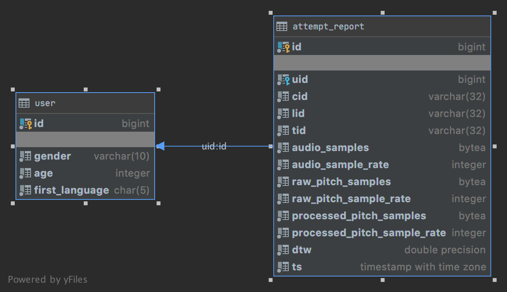

# Study Intonation Analytics service

Server address: [https://studyintonation-analytics.herokuapp.com/](https://studyintonation-analytics.herokuapp.com/)

## REST API methods

### Retrieve service status

`GET /v0/status`

Response: 

`200 OK`

`Content-Type: application/json`
```
{
    "status": "ONLINE"
}
```

### Register new anonymous user

`POST /v0/auth/register`

`Content-Type: application/json`

Body:
```
{
	"gender": "MALE",
	"age": 22,
	"firstLanguage": "ru-RU"
}
```

`gender` - **MUST** be one of `MALE`, `FEMALE`, `NON_BINARY`.

Response:

`202 Accepted`

`Content-Type: application/json`

Success:
```
{
    "status": "OK",
    "id": 1
}
```

`id` (long) - user id.

Failure:
```
{
    "status": "ERROR"
}
```

### Send user attempt report

`POST /v0/analytics/sendAttemptReport`

`Content-Type: application/json`

Body:
```
{
    "uid": 1,
    "cid": "0",
    "lid": "0",
    "tid": "1",
    "audio": {
        "samples": [1.0, ..., 1.3],
        "sampleRate": 44100
    },
    "rawPitch": {
	    "samples": [1.0, ..., 4.7],
	    "sampleRate": 8000
    },
    "processedPitch": {
	    "samples": [1.0, ..., 3.9],
	    "sampleRate": 256
    },
    "dtw": 1.2
}
```
`uid` (long) - user id obtained using `/v0/auth/register`.

`cid`, `lid`, `tid` (String) - course, lesson and task ids.

Response:

`202 Accepted`

`Content-Type: application/json`

Success:
```
{
    "status": "OK"
}
```

Failure:
```
{
    "status": "ERROR"
}
```

### Get users

`GET /v0/analytics/getUsers?token={token}`

`{token}` (String) (Required) - access token.

Response:

1. `200 OK`

    `Content-Type: application/json`

    Success:
    ```
    [
        {
           "id": 1,
            "gender": "MALE",
            "age": 21,
            "firstLanguage": "ru-RU" 
        }, ...
    ]
    ```

    Failure: an empty array `[]`

2. `400 Bad Request` (Missing required parameter)

    `Content-Type: application/json`

### Get attempt reports

`GET /v0/analytics/getAttemptReports?token={token}&uid={uid}&from={from}&to={to}`

`{token}` (String) (Required) - access token.

`{uid}` (long) (Optional) - user id. If missing, method returns attempt reports of all users.

`{from}` (Instant) (Optional) - from date. If missing, method returns attempt reports without lower date bound.

`{to}` (Instant) (Optional) - to date. If missing, method returns attempt reports up to now.

Date format: `2019-12-14T16:01:02.301902Z` UTC

Response:

1. `200 OK`

    `Content-Type: application/json`

    Success:
    ```
    [
        {
            "id": 309,
            "uid": 1,
            "cid": "0",
            "lid": "0",
            "tid": "1",
            "audio": {
                "samples": [1.0, ..., 1.3],
                "sampleRate": 44100
            },
            "rawPitch": {
                "samples": [1.0, ..., 4.7],
                "sampleRate": 8000
            },
            "processedPitch": {
                "samples": [1.0, ..., 3.9],
                "sampleRate": 256
            },
            "dtw": 1.2,
            "ts": "2019-12-14T14:09:33.908378Z"
        }, ...
    ]
    ```

    Failure: an empty array `[]`

2. `400 Bad Request` (Missing required parameter)

    `Content-Type: application/json`

### Remarks

Since service is hosted at heroku.com which proxies requests to our HTTP-server, any response may break the foregoing spec.

Client **SHOULD** be ready to receive unspecified response. 

## Postgres DB schema



## Technology stack

* Java 14
* Spring Boot [Webflux](https://docs.spring.io/spring/docs/current/spring-framework-reference/web-reactive.html) over [Reactor-Netty](https://github.com/reactor/reactor-netty)
* [Project-Reactor](https://github.com/reactor/reactor-core)
* Postgres SQL
* [R2DBC](https://r2dbc.io/) [postgres](https://github.com/r2dbc/r2dbc-postgresql) + [pool](https://github.com/r2dbc/r2dbc-pool) driver
